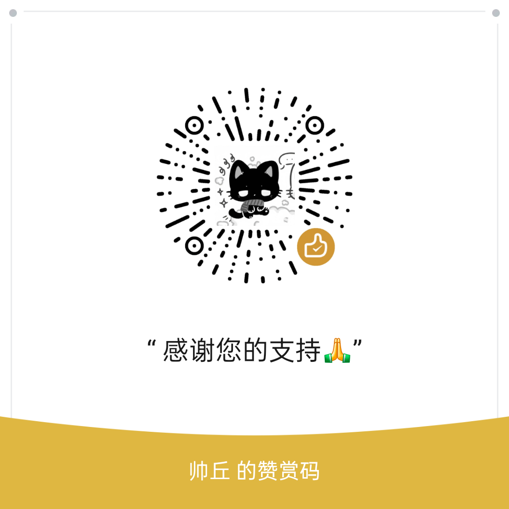

# Fuck ets100 - e听说答案提取器 📱

你是否还在面对数不尽的听说题而难堪，是否还在为没有人给你提供 e听说答案而困扰，是否还在为了达到老师要求的听说 30 分而感到不可能完成 ❓

现在，这款神器的诞生可以彻底解决你的困扰 ✨

## 🎯 这个软件干什么的

Fuck ets100 是一款专门为 e听说（ETS 100）用户打造的答案提取工具 📖

只要你的手机已经安装了 e听说 App，Fuck ets100 就能自动读取里面的答案数据，让你不用打开 e听说 也能随时查看答案 👀

**主要功能：**
- 📚 一键读取 e听说里的所有试卷答案
- ☁️ 支持云端模式，登录 ETS100 账号后在线获取作业列表和答案
- 🔍 支持多种题型：听说信息、信息转述、阅读理解等
- 📱 操作简单，点开就能用
- 🌙 支持深色模式，护眼舒适

---
## 🚀 怎么用

### 第一步：先装上

1. 打开 [releases 页面](https://github.com/qiuqiqiuqid/Fuck_ets100/releases)或[云盘](https://oplist.lastudio.cc/Fe_release)
2. 下载最新版本的 APK
3. 安装到你的手机上
4. 打开 Fuck ets100 App

如果手机提示“禁止安装未知来源应用”，按照系统提示允许一下就行，不是什么大问题啦。

### 第二步：选择读取方式

Fuck ets100 现在有几种读取方式，不知道选哪个的话，看这张表就够了 👇

| 方式 | 推荐程度 | 适合什么情况 |
|------|----------|--------------|
| 云端模式 | ⭐⭐⭐ 最推荐 | 想直接看云端作业，不想折腾文件权限 |
| 零宽字符直读 | ⭐⭐ 简单 | 想读取手机本地作业，并且设备支持 |
| Shizuku | ⭐⭐ 稳定 | 零宽字符直读不可用，愿意安装 Shizuku |
| Root | ⭐ 看情况 | 手机已经 Root，想直接读取本地数据 |

简单说：
- 只是想快速看作业答案：优先用 **云端模式**
- 想看手机里已经下载好的作业：试试 **零宽字符直读**
- 零宽字符直读不行：再用 **Shizuku**
- 手机本来就 Root 了：可以用 **Root**

### 第三步：按你的方式授权

#### ☁️ 云端模式

1. 进入“设置” → “运行授权”
2. 选择“云端模式”
3. 点击“登录 ETS100 账号”
4. 输入手机号和密码完成登录
5. 回到“读取”页面
6. 点击右下角“读取”
7. 确认提示后，等待云端作业列表加载
8. 点击作业，等待下载和解析完成

云端模式最省事，但可能会让 e听说 官方客户端被顶号。正在考试、练习、录音、提交的时候不要用，真的不要，喵。

#### ✨ 零宽字符直读

1. 进入“设置” → “运行授权”
2. 选择“零宽字符直读”
3. 按 App 提示完成授权
4. 回到“读取”页面
5. 点击右下角“读取”

如果提示“不支持”，说明你的设备可能用不了这个方式，换 Shizuku 或云端模式就行。

#### 🧩 Shizuku

1. 先安装并启动 [Shizuku](https://shizuku.rikka.app/)
2. 确认 Shizuku 已经正常运行
3. 回到 Fuck ets100
4. 进入“设置” → “运行授权”
5. 选择“使用 Shizuku”
6. 按提示授权
7. 回到“读取”页面点击“读取”

#### 🔓 Root

1. 确认手机已经 Root
2. 进入“设置” → “运行授权”
3. 选择 Root 读取方式
4. 授予 Root 权限
5. 回到“读取”页面点击“读取”

### 第四步：查看答案

读取成功后，试卷会显示在列表里 📋

点击任意一份试卷，就能看到里面的题目和答案啦 🎉

如果没有读出来，可以先检查：
- e听说 里对应作业有没有下载完成
- 当前读取方式有没有授权成功
- 云端模式账号有没有登录成功
- App 是不是最新版本
- 换一种读取方式再试试

---

## ☁️ 云端模式详解

云端模式不读取手机本地的 e听说数据目录，而是使用 ETS100 账号登录后，从云端接口获取作业列表和资源，再在本机解析题目与答案。

**适合这些情况：**
- 手机没有授予全文件访问、悬浮窗、应用列表等权限
- 本地没有下载完整作业资源
- 想直接查看 ETS100 云端作业列表

**使用步骤：**
1. 打开 App，进入“设置” → “运行授权”
2. 选择“云端模式”
3. 点击“登录 ETS100 账号”
4. 输入 ETS100 手机号和密码
5. 登录成功后，云端模式会显示“已激活”
6. 回到“读取”页面，点击右下角“读取”
7. 在风险提示弹窗中确认后，加载云端作业
8. 点击某个作业，等待下载和解析完成后查看答案

**重要风险提示：**
- 云端模式登录可能会导致 E听说官方客户端被退出登录，也就是常说的“顶号”
- 点击云端读取时也可能触发官方客户端登录状态变化
- 请确认当前没有正在使用 E听说，尤其不要在考试、练习、录音提交过程中使用云端读取
- 建议先用云端模式读取并查看答案，再去 E听说官方客户端做题
- 如果已经在 E听说里开始考试或练习，不要中途使用云端模式，否则可能导致连接断开或考试状态异常

**权限说明：**
- 云端模式不需要本地文件读取权限
- 云端模式不需要悬浮窗权限
- 云端模式不需要应用列表权限
- 本地读取模式仍然可能需要这些权限，取决于你选择的是零宽字符直读、Shizuku 还是 Root

---

**关于数据安全：**
- 本地读取模式不会上传你的本地文件
- 云端模式需要使用你的 ETS100 账号登录 ETS100 接口
- 云端模式会在本机保存登录信息，用于后续获取作业列表

---

## 📋 后续打算

Fuck ets100 还会继续更新迭代，以下是一些计划中的功能 💡

**计划中：**
- 🎨 优化界面，让看答案更舒服
- 📤 支持导出答案为文本或 PDF
- 🔄 自动检测 e听说 更新，同步最新试卷
- 📊 显示更多统计信息，比如正确率等
- 🌐 支持更多 e听说 以外的平台

如果你有什么好的建议或想法，欢迎在 [issues](https://github.com/qiuqiqiuqid/Fe/issues) 里提出来 ~

---

## ⚠️ 注意事项

- 本软件仅供学习交流使用，请勿用于考试作弊等违规行为
- 使用前请确保你已经购买了 e听说 的正版服务
- 如果 e听说 更新后软件无法使用，请耐心等待新版本发布

---

## 🙏 感谢

Fuck ets100 的诞生离不开这些"小伙伴"的帮助 💕

**人类贡献者：**
- [leitianshuo1337](https://github.com/code-leitianshuo) - 提供了全新api读取逻辑
- [Shizuku](https://shizuku.rikka.app/) - 让你不用 Root 也能管理文件
- [Jetpack Compose](https://developer.android.com/compose) - 让界面开发更简单
- [hicccc77](https://github.com/hicccc77) - 提供了全新的读取逻辑([WeFlow](https://github.com/hicccc77/WeFlow)作者)

---
## 📄 参考文档

- [@ETS100读取文档索引](./ets读取/README.md)
- [@答案解析方法](./ets读取/ets100答案解析方法.md)
- [@本地模式读取逻辑](./ets读取/本地模式读取逻辑.md)
- [@云端API与跨平台实现](./ets读取/API_DOC.md)
- [@云端模式逻辑](./ets读取/云端模式逻辑文档.md)
- [@企业登录_畅言](./ets读取/畅言网页登录.md)
- [@更新日志](/update.md)

---

## 🔗 相关仓库

- [laststudio/ets_get_answer](https://github.com/laststudio/ets_get_answer)
- [laststudio/eauxiliary](https://github.com/laststudio/eauxiliary)

---

**有问题？找作者：**
- GitHub: [issues 页面](https://github.com/qiuqiqiuqid/Fe/issues)
- 抖音:[抖音主页](https://v.douyin.com/P0GrWYTqi4s/)
- b站:[b站主页](https://space.bilibili.com/2116040615h)

祝你使用愉快 🎉

---

## 💰 捐赠支持

如果这个项目对你有帮助，欢迎请作者喝杯奶茶 ☕，你的支持是持续更新的最大动力！

| 支付宝 | 微信支付 |
|:---:|:---:|
|  |  |

> 💖 每一份捐赠都是对开源精神的肯定，感谢你的支持！
