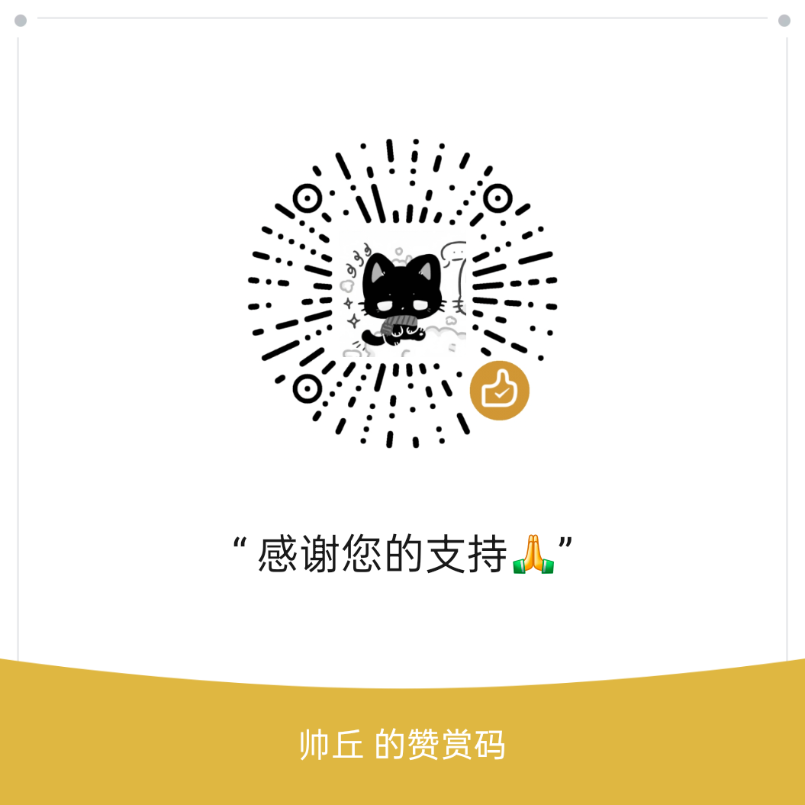

# Fe (Fuck_ets100) · 科大讯飞 e听说作业答案提取与自动完成辅助套件 📱

> 本仓库现作为面向用户的公开文档、使用指南、问题反馈与 Release 下载入口维护。项目源码已转为私有维护，后续正式版本仍会在本仓库的 Releases 页面与官方主站同步发布。
>
> 🌐 **官方发布平台与主站**：[https://lastudio.cc](https://lastudio.cc)  
> ⚡ **Fe (Fuck_ets100) 官方极速直链下载**：[https://lastudio.cc/download?app=fe](https://lastudio.cc/download?app=fe)（免登录、不限速）  
> 💻 **Fe Web 网页版在线提取**：[https://fe-web.lastudio.cc](https://fe-web.lastudio.cc)（无需安装手机 App，电脑/手机浏览器在线查答案）  
> 📁 **网盘分流与历史版本**：[https://oplist.lastudio.cc/Fe_release](https://oplist.lastudio.cc/Fe_release)  
> 📦 **GitHub Releases 发布页**：[https://github.com/laststudio/Fuck_ets100/releases](https://github.com/laststudio/Fuck_ets100/releases)

> 🏷️ **核心搜索关键词**：  
> **品牌与项目**：Fe | Fuck_ets100 | Fuck ets100 | 科大讯飞e听说 | 讯飞e听说 | e听说中学 | 畅言教育 | LastStudio (lastudio)  
> **核心功能词**：e听说答案 | e听说作业答案 | e听说自动完成 | e听说考试答案 | e听说外挂 | 英语听说答案 | ets100 | e听说模拟考试  
> **支持题型与技术**：听选信息答案 | 回答问题答案 | 信息转述答案 | 短文朗读 | 模仿朗读 | 云端直连模式 | 零宽字符直读 | Shizuku免Root

---

## 🔒 关于项目闭源

本项目已经停止公开源代码，后续开发和维护将在私有仓库中进行。本仓库继续面向普通用户，保留软件下载、使用教程、更新日志和问题反馈功能。

作出闭源决定的主要原因如下：

- 本项目的主要服务对象是软件用户，而不是二次开发者；对绝大多数用户而言，稳定的安装包、清晰的教程和可靠的更新比公开源码更有实际意义。
- 在此前的开源维护过程中，项目几乎没有收到有效的 Pull Request，公开源码没有带来预期中的共同维护、技术反馈或社区协作。
- 实际收到的有效问题反馈非常有限，开源并未明显改善软件质量或降低维护成本。
- 公开源码反而增加了未经授权搬运、低质量二次修改、重新打包、冒名分发以及利用项目圈钱的风险，也容易造成版本混乱和用户安全问题。
- 为了集中维护精力、保证正式版本来源清晰，并减少滥用和不负责任的二次分发，项目决定转为闭源维护。

闭源不代表停止维护。用户仍可通过本仓库下载正式版本、阅读文档、查看更新日志，并通过 Issues 提交可复现的问题或合理建议。源码、构建细节及私有仓库访问权限不再对外提供。

自闭源版本起，本项目不再以开源软件形式发布。仓库中保留的历史资料仅用于文档展示和版本说明，不代表授予复制、修改、重新打包、分发或商业使用当前版本的许可。

---

你是否还在面对数不尽的英语听说题而难堪？是否还在为没有人给你提供 **e听说答案** 而困扰？是否还在为了达到老师要求的听说 30 分而感到不可能完成 ❓

现在，**Fe (Fuck_ets100)** 的诞生可以彻底解决你的困扰 ✨

  
  
<b>科大讯飞 e听说 (ETS100) 现代作业答案提取与辅助完成套件</b>

---

## 🎯 这个软件干什么的

**Fe (Fuck ets100)** 是一款专门针对**科大讯飞 e听说（ETS 100）**用户打造的现代化答案提取与作业辅助工具 📖

无需繁琐复杂的操作，Fe 能够全自动解析并提取 e听说 中的试卷试题与官方标准答案，让你不用打开官方 App 也能随时查阅完整解析，告别低效作业负担 👀

### 核心功能特性：
- 📚 **全题型作业答案一键读取**：一键解析提取 e听说 试卷题目、听力原文及标准参考答案。
- ☁️ **官方云端直连模式**：支持直接使用畅言/ETS100 账号云端登录，免文件访问权限、免 Root 即可直接拉取作业列表与答案解析。
- 🔍 **全题型深度覆盖**：全面支持听选信息、回答问题、信息转述、短文朗读、模仿朗读及全真模拟考试等丰富题型。
- ⚡ **本地免 Root 兼容技术**：独创支持**零宽字符直读**，兼容 **Shizuku** 提权与 Root 直读，各类 Android 机型均能完美适配。
- 💻 **多端协同互通**：除 Android App 外，LastStudio 还同步提供 [Fe Web 网页版](https://fe-web.lastudio.cc)，电脑或浏览器端免安装即开即查。
- 📱 **纯净操作体验**：点开即用、无广告植入，原生支持 Material You / 动态深色模式，护眼舒适。

---

## 🚀 极速上手教程

### 第一步：获取应用安装包

1. 推荐前往 **[LastStudio 官方极速下载通道](https://lastudio.cc/download?app=fe)** 获取最新 APK（免登录、CDN 节点高速不限速直链）；
2. 亦可在 [GitHub Releases 页面](https://github.com/laststudio/Fuck_ets100/releases) 或 [网盘分流](https://oplist.lastudio.cc/Fe_release) 下载；
3. 下载完成后安装至 Android 手机（若系统提示“允许安装未知来源应用”，授权通过即可）；
4. 打开 **Fe (Fuck ets100)** 应用。

---

### 第二步：选择最适合你的读取方式

根据你的设备环境与权限情况，对照下表即可轻松选择：

| 模式 | 推荐等级 | 适合场景 | 权限要求 |
| :--- | :---: | :--- | :--- |
| **☁️ 云端模式** | ⭐⭐⭐ **最推荐** | 想直接获取最新作业与试卷，不想折腾手机本地存储权限 | **零特殊权限**（无需存储/悬浮窗） |
| **✨ 零宽字符直读** | ⭐⭐ **轻量便捷** | 想直接读取手机本地已下载的作业，且设备系统支持该漏洞接口 | 基础无障碍/本地读写 |
| **🧩 Shizuku** | ⭐⭐ **稳定可靠** | 零宽字符不兼容的系统，已安装配置好 Shizuku 服务 | Shizuku ADB 授权（免 Root） |
| **🔓 Root 模式** | ⭐ **极客可选** | 手机已获取 Root 权限（Magisk / KernelSU / APatch） | Superuser Root 权限 |

**速选指南：**
- **追求简单省心**：直接使用 **云端模式**（最推荐，免权限）；
- **想查看本地已离线作业**：优先尝试 **零宽字符直读**；
- **零宽字符不可用**：使用 **Shizuku** 模式；
- **已 Root 设备**：可直接使用 **Root** 模式读取。

---

### 第三步：按选定模式配置授权

#### ☁️ 模式一：云端模式（推荐）
1. 进入应用底部 **“设置” → “运行授权”**；
2. 选择 **“云端模式”** 并点击 **“登录 ETS100 账号”**；
3. 输入手机号与密码完成认证（或通过畅言扫码网页登录）；
4. 返回主界面 **“读取”** 页面，点击右下角 **“读取”** 按钮；
5. 确认安全提示后，等待云端作业列表刷新；
6. 点击目标作业任务，稍候片刻即可完成完整答案解析。

> ⚠️ **温馨提示**：云端模式直接访问官方接口，读取期间请勿在官方 e听说 App 中进行正在录音、考试或提交操作，避免异地登录引起状态变动。

#### ✨ 模式二：零宽字符直读
1. 进入 **“设置” → “运行授权”**，选择 **“零宽字符直读”**；
2. 按照屏幕引导完成系统授权；
3. 返回 **“读取”** 页面点击右下角按钮读取本地作业数据。
> *如提示“当前设备不支持”，请改用云端模式或 Shizuku 模式。*

#### 🧩 模式三：Shizuku 模式（免 Root）
1. 确保手机已安装并激活 [Shizuku](https://shizuku.rikka.app/) 服务；
2. 进入 Fe 的 **“设置” → “运行授权”**，勾选 **“使用 Shizuku”**；
3. 允许 Fe 请求的 Shizuku API 授权，回到读取页面点击 **“读取”**。

#### 🔓 模式四：Root 模式
1. 确认手机具备 Root 运行环境；
2. 在 **“运行授权”** 中选择 **Root 模式**；
3. 弹出超级用户弹窗时点击“允许”，随后在读取页面获取数据。

---

### 第四步：查阅、核对与导出答案

读取成功后，所有试卷作业将整齐排列在列表清单中 📋
- 点击任意一份作业，即可查看题目详情、听力音频文本与标准答案解析 🎉；
- 支持多种题型的答题提示、重点词汇标注与参考范文；
- 若出现未读出情况，请检查：
  - e听说 官方应用内该份作业资源是否已下载完全；
  - 授权模式是否正常激活生效；
  - 云端登录会话是否过期，或更新至最新版本重试。

---

## 💻 网页版专属入口：Fe Web

不想在手机上折腾安装包？LastStudio 团队专门打造了全平台可用的 **Fe Web 在线版**！

- 🌐 **Fe Web 网址**：[https://fe-web.lastudio.cc](https://fe-web.lastudio.cc)
- 🖥️ **跨平台支持**：Windows、macOS、Linux、iPad、iOS 及 Android 浏览器直接访问，无需配置任何权限；
- ⚡ **功能特性**：支持畅言 / e听说账号登录、直接在线解析题库试卷、题目答卷直观查阅，轻量便捷。

---

## ☁️ 云端模式详解与数据安全

- **数据交互原理**：云端模式直接与 ETS100 云端服务对接获取试卷资源，不扫描、不读取用户手机本地存储与非关联文件。
- **权限极简**：无需文件读写权限、无需悬浮窗权限、无需应用列表扫描权限。
- **安全保障**：所有登录凭证仅加密保存在设备本机沙盒，绝无任何第三方数据外传。

---

## 📋 后续规划与功能展望

Fe 将持续跟进官方版本变动，计划中的新功能包括 💡：
- 🎨 全新视觉交互与长卷排版体验优化
- 📤 支持将试卷与标准答案一键导出为纯文本 (TXT) 或高清 PDF 文档
- 🔄 智能检测官方题库更新与试卷版本同步
- 📊 题目答题技巧与常考语法知识点速查

如有功能需求或 Bug 反馈，欢迎前往 [GitHub Issues](https://github.com/laststudio/Fuck_ets100/issues) 提交。

---

## ⚠️ 免责声明与使用规范

1. **学习交流定位**：本工具仅供技术交流、英语学习复习核对与作业错题排查参考，严禁将本软件用于任何形式的正式考试作弊等违规用途；
2. **正版教育支持**：使用前请确保你已拥有科大讯飞 e听说 平台的合法正版服务使用权限，尊重软件版权；
3. **接口更新免责**：若因官方客户端协议调整导致暂时不可用，请关注 Releases 与更新日志等待版本适配。

---

## 🙏 致谢与生态开源项目

Fe 的诞生与持续演进离不开以下开源生态与技术贡献者：

- [leitianshuo1337](https://github.com/code-leitianshuo) - 提供全新 API 数据读取架构思路
- [Ken-gugugaga](https://github.com/Ken-gugugaga) - 提供自动化核心方法与关键实现代码
- [hicccc77](https://github.com/hicccc77) - 提供全新读取逻辑参考（[WeFlow](https://github.com/hicccc77/WeFlow) 作者）
- [Shizuku](https://shizuku.rikka.app/) - 优秀的免 Root 权限桥梁
- [Jetpack Compose](https://developer.android.com/compose) - 现代化 Android UI 开发框架

---

## 📄 关联文档与协议

- 📜 [@软件使用协议与免责声明](./USER_AGREEMENT.md)
- 📝 [@版本更新日志](./update.md)
- 📚 [@ETS100读取文档索引](./ets读取/README.md)
- 🔍 [@答案解析核心方法](./ets读取/ets100答案解析方法.md)
- 📂 [@本地模式读取逻辑](./ets读取/本地模式读取逻辑.md)
- 🌐 [@云端API与跨平台实现](./ets读取/API_DOC.md)
- ⚙️ [@云端模式逻辑文档](./ets读取/云端模式逻辑文档.md)
- 🔑 [@畅言网页登录解析](./ets读取/畅言网页登录.md)

---

## 🔗 相关项目与官方服务

- 🌐 [LastStudio 官方主站 (lastudio.cc)](https://lastudio.cc)
- 🚀 [Fe 官方极速下载通道](https://lastudio.cc/download?app=fe)
- 💻 [Fe Web 在线提取平台](https://fe-web.lastudio.cc)
- 🦅 [Eklose · 翼课网学习辅助配套工具](https://github.com/laststudio/eklose)
- 📦 [laststudio/ets_get_answer](https://github.com/laststudio/ets_get_answer)
- 📦 [laststudio/eauxiliary](https://github.com/laststudio/eauxiliary)

**联系与反馈：**
- GitHub Issues: [问题反馈与建议](https://github.com/laststudio/Fuck_ets100/issues)
- 官方抖音: [抖音主页](https://v.douyin.com/P0GrWYTqi4s/)
- 官方B站: [B站主页](https://space.bilibili.com/2116040615h)

---

## 💰 赞助支持

如果 Fe 在你的学习过程中帮到了你，欢迎请作者喝杯奶茶 ☕，你的支持是项目长期维护与更新的最大动力！

| 支付宝 | 微信支付 |
| :---: | :---: |
|  |  |

> 💖 感谢每一位陪伴和支持 LastStudio 成长的小伙伴！
